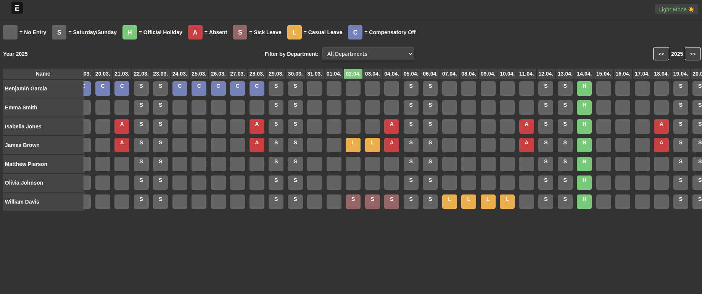
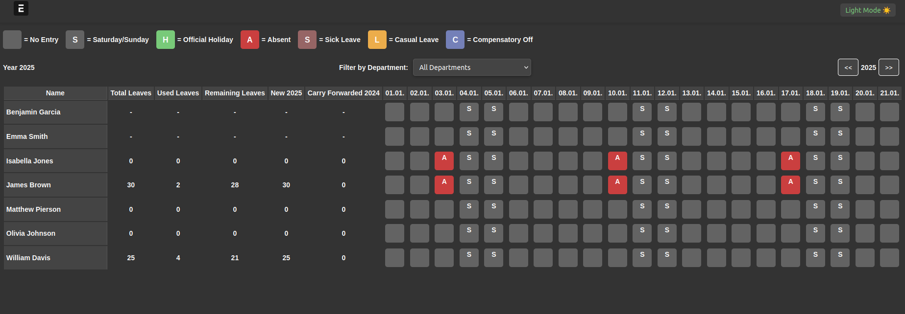
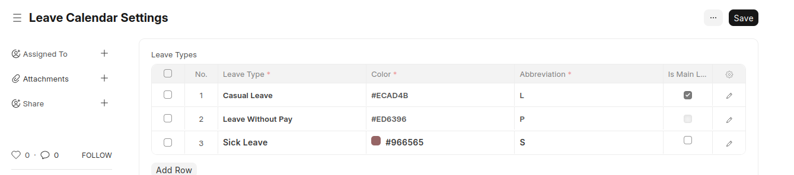

## Leave Calendar

### Overview

The **Leave Calendar** is an application for ERPNext that provides an overview of employee leaves. It allows users to view leave records based on their roles and permissions. To use this feature, **ERPNext** and the **HRMS module** must be installed beforehand.

### Access

The Leave Calendar can be accessed via `**/leave_calendar**` in the system.

### Permissions

- **System Managers**: Can view all leave records, including the total number of leave days.
    
- **Leave Approvers**: Can view leave records of employees they are assigned to approve, as well as their own leaves. Additionally, they can view leave records of employees assigned to a department where they are designated as a **Leave Approver**.
    
- **Regular Employees**: Can only see their own leave records.
    
- When viewing other employees' leaves, users will not see exact leave details but instead a general "Absent" status.
    

### Configuration

In the **Leave Calendar Settings**, administrators can configure:

- The list of **Leave Types** to be displayed in the calendar. Any leave type not listed will appear as "Absent".
    
- Custom **colors** and **shortcodes** for each leave type.
    
- The designation of a **primary leave type**.

### Holiday List Integration

The Leave Calendar automatically considers the **Holiday List** assigned to each employee. This includes:

- **Weekends** (e.g., Saturdays and Sundays, based on company settings).
    
- **Public Holidays** specific to the employee's assigned holiday list.
    
- **Part-time Work Schedules**, ensuring accurate leave tracking for employees with reduced working hours.
    

### Theme Support

The Leave Calendar is available in both **Dark Mode** and **Light Mode**, allowing users to choose their preferred display setting.

### License and Company

This project is licensed under **GPLv3** and published from K&K Software AG.